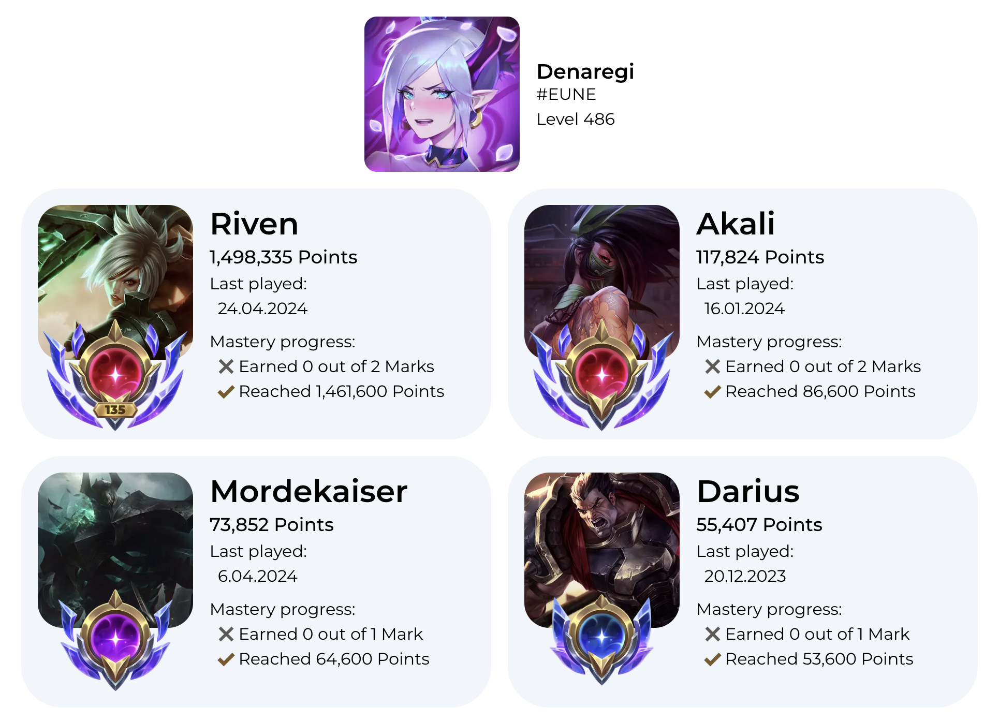
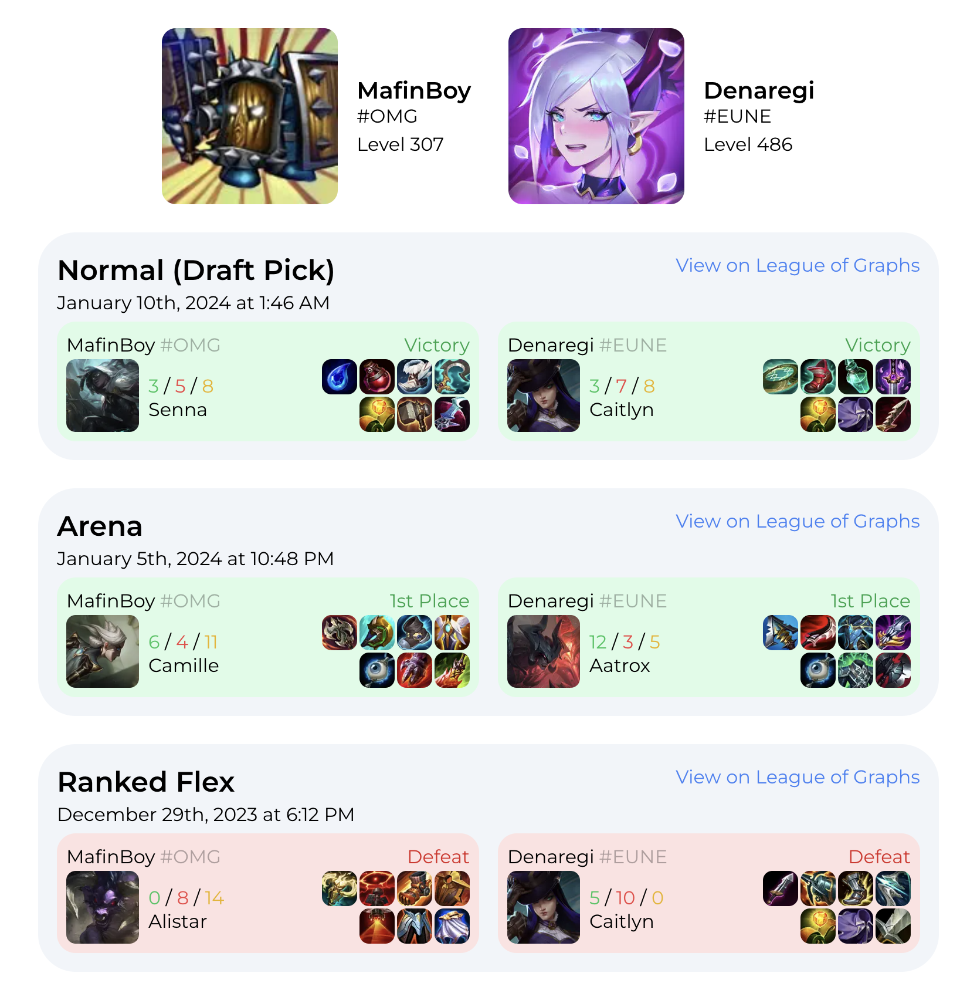

# Orange Minion

Orange Minion is an open-source website offering a collection of tools for [League of Legends](https://www.leagueoflegends.com).

Built with [Next.js](https://nextjs.org), this project provides easy-to-use tools to display champion mastery, track common games with friends, and more in the future.

## Features

### Mastery Viewer
Easily view and showcase your champion masteries in a visually appealing layout.



### Common Games Viewer
Quickly view all games you have played with another player, allowing you to analyze your shared history and collaboration.



## Contributing

Contributions are welcome! If you have an idea for a new feature or improvements, feel free to submit a pull request. Before contributing, please check the [Issues](https://github.com/kloczewiak/orange-minion/issues) tab to see if there are any outstanding items that could use your help.

### How to Contribute
1. Fork the repository and create a new branch for your feature or fix.
2. Make your changes, and ensure your code adheres to the project’s coding standards.
3. Submit a pull request, detailing the changes and why they are beneficial.

## Getting Started

If you're interested in contributing, follow these instructions to set up a local development environment.

### Prerequisites
- [pnpm](https://pnpm.io/) (Package manager used for managing project dependencies)
- A Riot API key, which you can obtain from the [Riot Developer Portal](https://developer.riotgames.com/).

### Installation
Clone the repository and install dependencies:

```bash
pnpm install
```

Add your Riot API key to a `.env.local` file in the project root:

```bash
RIOT_API_KEY=your_riot_api_key_here
```

### Running the Development Server
Start the development server:

```bash
pnpm dev
```

Open [http://localhost:3000](http://localhost:3000) in your browser to view the application.

## License

This project is licensed under the MIT License. See the [LICENSE](./LICENSE) file for more information.

## Acknowledgments

- This project was bootstrapped with [`create-next-app`](https://nextjs.org/docs/app/api-reference/cli/create-next-app).
- Thanks to the open-source community and League of Legends enthusiasts who help make this project better.

---

**Enjoy using Orange Minion, and may your games be ever victorious!**
